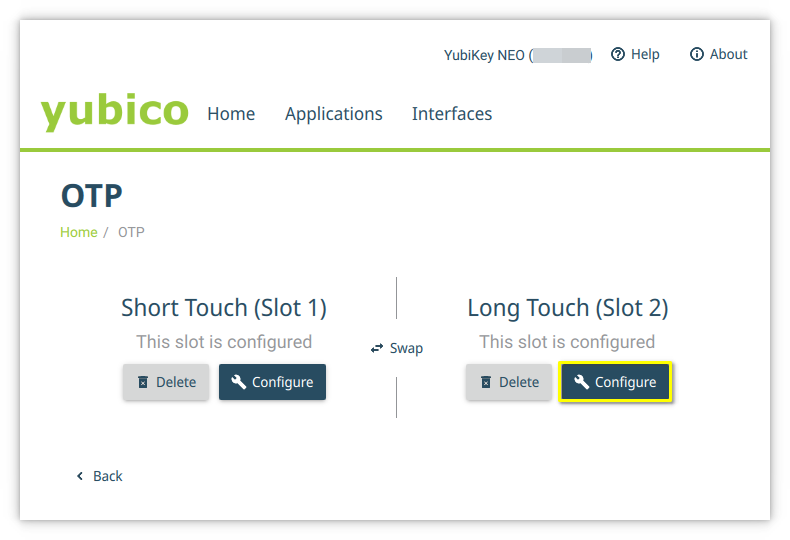
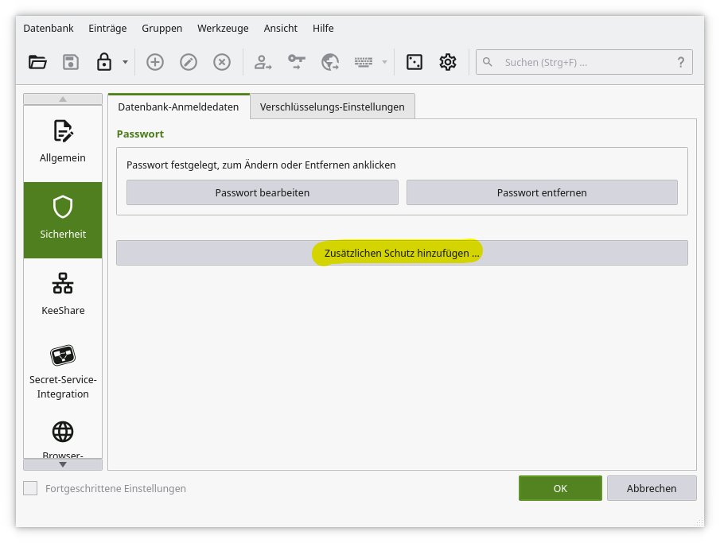

# Yubikey Best Practices

We suggest buying at least two [Yubikeys](https://www.yubico.com/products/yubikey-5-overview/), e.g. Yubikey NFC and Nano. This way you have one key for your key chain and mobile and one small e.g. for laptops etc.

## SSH and Yubikeys

You can secure your SSH keys with [Yubikeys](https://developers.yubico.com/SSH/). This guide will only discuss securing `ed25519` SSH keys using [FIDO2](https://developers.yubico.com/SSH/Securing_SSH_with_FIDO2.html). For other options see this [link](https://developers.yubico.com/SSH/), for `ecdsa` SSH keys see this [link](https://developers.yubico.com/SSH/Securing_SSH_with_FIDO2.html). The followong requirements must be met:
* OpenSSH 8.2p1, local and remote, if you want to use non-discoverable keys.
* OpenSSH 8.3, local and remote, if you want to use discoverable keys.

### Configure Yubikey for FIDO2

First you need to configure your Yubikeys for FIDO2.

> **WARNING:** If you forget your PIN or reset FIDO2 credentials, all FIDO2 secrets will be wiped! You should always create secrets on at least two separate keys.

* Install and run the [Yubikey Manager](https://www.yubico.com/support/download/yubikey-manager/). Some OS already offer packages, e.g. Archlinux `yubikey-manager`.
* Select "Applications" -> "FIDO2".


* Select "Set PIN" if you have not yet configured your Yubikey. If you have already set the PIN, you do not need to do anything else.


* Set a new PIN. Alternatively, you can change your old PIN if you wish. Once the PIN is set, you have a maximum of 8 attempts to enter your PIN correctly, otherwise you will have to reset your FIDO2 credentials.


### Create SSH keys with FIDO2

There are two types of ssh keys, discoverable (resident) and non-discoverable. For a detailed description, see the documentation at [Yubico](https://developers.yubico.com/SSH/Securing_SSH_with_FIDO2.html).

* Discoverable means that the key is stored on your Yubikey and you can copy it to a local machine at any time with `ssh-keygen -K`. You always need your FIDO2 PIN when using discoverable SSH keys.
* Non-Discoverable means that the key is stored only locally on the machine. You do not need your FIDO2 PIN for non-discoverable SSH keys.
* For the SSH keys to work, you always need the Yubikey for both credential types!

If you do not need a portable SSH key and do not want to enter the FIDO2 PIN every time, e.g. for frequently used hosts like jumphosts, using non-discoverable SSH keys is preferable.

#### Creating Non-Discoverable SSH Keys

To create a non-discoverable SSH key, simply connect your Yubikey and run the following command in your shell:
```bash
ssh-keygen -t ed25519-sk
```

Choose a meaningful name like `id_ed25519_sk_nd_jumphost`. For example, here `nd` stands for non-discoverable. You can omit the ssh key password, since your key is already secured by FIDO2.

##### Deleting Non-Discoverable SSH Keys

Just delete the key from your SSH directory.

#### Creating Discoverable SSH Keys

To create a discoverable SSH key, simply connect your Yubikey and run the following command in your shell:
```bash
ssh-keygen -t ed25519-sk -O resident -O application=ssh:<MeaningfulNameOrIdentifier> -O verify-required
```

Choose a meaningful name like `id_ed25519_sk_rk_jumphost`. For example, here `rk` stands for discoverable/resident key. You can omit the ssh key password, since your key is already secured by FIDO2.

##### Copying Discoverable SSH Keys from your Yubikey to your local SSH directory

You just need to run `ssh-keygen -K` with the Yubikey connected. The Yubikey will create a SSH key file named `id_ed25519_sk_rk_<Identifier>`.

##### Deleting Discoverable SSH Keys

For discoverable SSH keys, you will need to delete them from your FIDO2 credentials. Follow these steps:

1. Connect your Yubikey.
2. Run in a shell: `ykman fido credentials list`
```bash
Enter your PIN: 
ssh:jumphost 0000000000000000000000000000000000000000000000000000000000000000 openssh
```
3. Delete the SSH key you no longer need from your FIDO2 credentials: `ykman fido credentials delete ssh:jumphost`
```bash
Enter your PIN: 
Delete credential ssh:jumphost 0000000000000000000000000000000000000000000000000000000000000000 openssh? [y/N]: y
```
4. Delete the key from your SSH directory.

### SSH configuration for FIDO2-secured SSH keys

SSH always requires touch verification when using FIDO2 keys, at least in our tests with OpenSSH version 9.2 on Archlinux. When creating the keys locally with aforementioned SSH, the default flag `touch-required` ([`SSH_SK_USER_PRESENCE_REQ`](https://github.com/openssh/openssh-portable/blob/master/sk-api.h#L26)) is saved into every FIDO2 SSH key.

If you used above configuration which is derived from Yubico, `touch-required` will be set for the non-discoverable SSH keys, `verify-required` ([SSH_SK_USER_VERIFICATION_REQD](https://github.com/openssh/openssh-portable/blob/master/sk-api.h#L26)) will be set for the discoverable SSH keys with option `-O verify-required` (if you want to verify your key dump, see [SSH protocol](https://github.com/openssh/openssh-portable/blob/master/PROTOCOL.u2f#L87)). Also, the FIDO2 flags are output when using the `-v` option with SSH (`ssh -v`).
```
debug1: sshsk_sign: provider "internal", key ED25519-SK, flags 0x01   # touch-required
debug1: sshsk_sign: provider "internal", key ED25519-SK, flags 0x25   # touch-required, verify-required, resident
```

In context of OpenSSH `touch-required` means that you have to touch your Yubikey to verify your presence. `verify-required` means that you need to enter your FIDO2 PIN, you will have to touch your Yubikey to verify your presence as well.

If you want to configure your SSH server differently, set `PubkeyAuthOptions verify-required` or `PubkeyAuthOptions touch-required`, (see [PubkeyAuthOptions](https://man.openbsd.org/sshd_config#PubkeyAuthOptions)). Alternatively, you can append either `verify-required` or `touch-required` to the end of your key in `~/.ssh/authorized_keys` if you do not want to change the configuration of your SSH server. In our tests, these configurations had no effect, since they were probably overridden by the key flags.

To be able to use all Yubikeys, multiple identities can be passed to SSH. SSH will then go through all identities when connecting. Just add several lines of `IdentityFile` in the local configuration `~/.ssh/config`.
```
Host jumphost1 jumphost2
    User jumpuser
    IdentityFile ~/.ssh/id_ed25519_sk-nd-jumphost-key1
    IdentityFile ~/.ssh/id_ed25519_sk-nd-jumphost-key2
```

### Setting a default FIDO2-secured SSH key with UDEV

Some applications support only one SSH key. For example, you can define only one `signingkey` in the Git configuration. If you want to use FIDO2-secured SSH keys from both Yubikeys, this is a problem.

With the script [`fido2_set_default_ssh_key`](usr/local/bin/fido2_set_default_ssh_key) you can create a link to a FIDO2-secured SSH key for the currently plugged in Yubikey. This way you can always use the default link when you want to use your FIDO2-secured SSH keys.

Just copy the file to `/usr/local/bin/` or somewhere in `$HOME` and copy [`90-yubikey.rules`](etc/udev/rules.d/90-yubikey.rules) to `/etc/udev/rules.d/` on your local machine. Change the placeholder `<USER>` to your local username and change the path of the script if necessary. Now every time you connect one of your Yubikeys, one of your FIDO2-secured SSH keys will be available via the path `~/.ssh/id_ed25519_sk_default`.

To use the link to your current SSH key for SSH connections, insert it before the other IdentityFile entries so that it is used first (`~/.ssh/config`).
```
Host jumphost1 jumphost2
    User jumpuser
    IdentityFile ~/.ssh/id_ed25519_sk_default
    IdentityFile ~/.ssh/id_ed25519_sk-nd-jumphost-key1
    IdentityFile ~/.ssh/id_ed25519_sk-nd-jumphost-key2
```

## KeepassXC and Yubikey

You can use a Yubikey for a second secret using Challenge-Response. This works also with [Keepass2Android](https://play.google.com/store/apps/details?id=keepass2android.keepass2android).

### Configure Yubikey for Challenge-Response

First you need to configure your Yubikeys for Challenge-Response.

> **WARNING:** Use at least two keys and print out and secure your secret!

* Install and run the [Yubikey Manager](https://www.yubico.com/support/download/yubikey-manager/). Some OS already offer packages, e.g. Archlinux `yubikey-manager`.
* Select "Applications" -> "OTP".


* Select "Configure" for "Long Touch (Slot 2)".



* Select "Challenge-response" and click "Next".


* On the first key you set up you can use "Generate" to create a secret. On every following key you will have to copy this key to this field. Select "Require touch" and end configuration with "Finish".

  >  **WARNING: Secure this key, so that you can copy it to another key. Once you click "Finish" you won't be able to get the secret again.


* Now you should set up another key and secure your secret. We suggest printing it an keep is somewhere safe.
* Remove Yubikey and insert the new Yubikey. Start Yubikey Manager.
* Configure "Slot 2" for Challenge-response.
* This time **DO NOT** generate a secret. Copy your saved secret from key one to this field.

Once your Yubikeys are configured, go to the next step, Configuring KeepassXC for Yubikey.

### Configuring KeepassXC for Yubikey

> **WARNING:** First make sure you have at least two Yubikeys configures for Challenge-Response and cave a copy and backup of the secret. If you lose this credentials you won't be able to open your database!
>
> When you modify an existing database it is recommended to create a backup first.

Start your existing KeepassXC database. If you are creating a new database the window for password will look the same, you will need to "Add additional protection", as well.

* Start KeepassXC, open existing database and select "Database" -> "Database Settings".


* Select "Security" on the left and select "Add additional protection".



* Select "Add Challenge-Response".


* Select the slot on your Yubikey. If it is not inserted yet, insert a Yubikey and click "Refresh" Finish configuration with with "OK".


Tap your Yubikey. Your configuration is saved.


* To open your database you need to insert your Yubikey. And then type in your password. Once you try to unlock your database KeepassXC will ask you to tap your Yubikey for Challenge-Response. If your key is not listed, click "Refresh" and select the correct slot.


> **WARNING:** Test every newly configured Yubikey for a working Challenge-Response configuration!


## Yubikey and sudo and login

You can find an article at [Yubico](https://support.yubico.com/hc/en-us/articles/360016649099-Ubuntu-Linux-Login-Guide-U2F) for for an installation on Ubuntu. This works with Yubikey 4, as well. You can configure your Yubikey to be sufficient for authorization or that you need to tap it after password entry.

> **WARNING:** Use at least two keys!

### Installation and Configuration

First install the PAM module for Yubikey, e.g. `yubico-pam` for Archlinux, `libpam-u2f` for Ubuntu (see [article](https://support.yubico.com/hc/en-us/articles/360016649099-Ubuntu-Linux-Login-Guide-U2F)).

The next steps uses `/etc/Yubico` for system-wide configuration, but you can always choose to use user-only configuration in `~/.yubico`.

1. Insert your Yubikey.
2. Run: `pamu2fcfg >u2f_keys`
3. Tap your Yubikey.
4. Remove your Yubikey. Insert a new Yubikey and do the following steps:
5. For every following Yubikey append to file with option `-n`: `pamu2fcfg -n >>u2f_keys`
6. Tap your Yubikey.
7. Remove the Yubikey and repeat the previous steps 5-7 for the rest of your keys.
8. Create config directory: `sudo mkdir /etc/Yubico`
9. Move your secrets to Yubico configuration directory: `sudo mv u2f_keys /etc/Yubico/`
10. Make sure the right is correct (not necessary for configuration in `~/.yubico`):

```bash
sudo chmod 644 /etc/Yubico/u2f_keys
sudo chown root.root /etc/Yubico/u2f_keys
```

### Configure Yubikey to be used for sudo

For Yubikey to be used for sudo you will need to add the following lone to `/etc/pam.d/sudo`:

```pam-config
auth		sufficient/required	pam_u2f.so	authfile=/etc/Yubico/u2f_keys	cue [cue_prompt=Please tap Yubikey]
```

See below examples for the correct configuration.

> **WARNING:** Open a new root terminal (`sudo -i`) and keep it open until you are sure the configuration works as expected.

Open the sudo PAM configuration:

```bash
sudo vim /etc/pam.d/sudo
```

* If you want Yubikey to be **sufficient** for sudo you can add the module at the top of `/etc/pam.d/sudo`.

  > INFO: In this case you don't need your Yubikey. You can always use your password.

  Example for Archlinux:

  ````pam-config
  #%PAM-1.0
  auth		sufficient	pam_u2f.so	authfile=/etc/Yubico/u2f_keys	cue [cue_prompt=Please tap Yubikey]
  auth		include		system-auth
  account		include		system-auth
  session		include		system-auth
  ````

* If you  want Yubikey to be **required** after/before password entry for sudo you can add at the module before/after the include of system-auth/common-auth in `/etc/pam.d/sudo`.

  > **WARNING:** In this case you will **NEED**  a Yubikey for sudo. If you lose it you need to use other methods to become root or to change `/etc/pam.d/sudo`.

  Example for Archlinux:

  ````pam-config
  #%PAM-1.0
  auth		include		system-auth
  auth		required	pam_u2f.so	authfile=/etc/Yubico/u2f_keys	cue [cue_prompt=Please tap Yubikey]
  account		include		system-auth
  session		include		system-auth
  ````

### Configure Yubikey to be used for Terminal Login

* TODO

### Configure Yubikey to be used for Desktop Manager Login

* TODO
