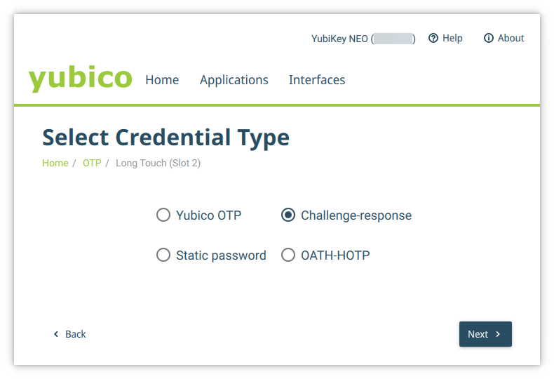
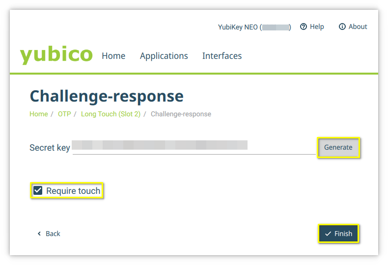

# Yubikey Best Practices

We suggest buying at least two [Yubikeys](https://www.yubico.com/products/yubikey-5-overview/), e.g. Yubikey NFC and Nano. This way you have one key for your key chain and mobile and one small e.g. for laptops etc.

## KeepassXC and Yubikey

You can use a Yubikey for a second secret using Challenge-Response. This works also with [Keepass2Android](https://play.google.com/store/apps/details?id=keepass2android.keepass2android).

### Configure Yubikey for Challenge-Response

First you need to configure your Yubikeys for Challenge-Response.

> **WARNING:** Use at least two keys and print out and secure your secret!

* Install the [Yubikey Manager](https://www.yubico.com/support/download/yubikey-manager/) and start it. Some OS provide already packages, e.g. Archlinux `yubikey-manager`.
* Select "Applications" -> "OTP".


* Select "Configure" for "Long Touch (Slot 2)".


* Select "Challenge-response" and click "Next".



* On the first key you set up you can use "Generate" to create a secret. On every following key you will have to copy this key to this field. Select "Require touch" and end configuration with "Finish".

  >  **WARNING: Secure this key, so that you can copy it to another key. Once you click "Finish" you won't be able to get the secret again.



* Now you should set up another key and secure your secret. We suggest printing it an keep is somewhere safe.
* Remove Yubikey and insert the new Yubikey. Start Yubikey Manager.
* Configure "Slot 2" for Challenge-response.
* This time **DO NOT** generate a secret. Copy your saved secret from key one to this field.

Once your Yubikeys are configured, go to the next step, Configuring KeepassXC for Yubikey.

### Configuring KeepassXC for Yubikey

> **WARNING:** First make sure you have at least two Yubikeys configures for Challenge-Response and cave a copy and backup of the secret. If you lose this credentials you won't be able to open your database!
>
> When you modify an existing database it is recommended to create a backup first.

Start your existing KeepassXC database. If you are creating a new database the window for password will look the same, you will need to "Add additional protection", as well.

* Start KeepassXC, open existing database and select "Database" -> "Database Settings".


* Select "Security" on the left and select "Add additional protection".


* Select "Add Challenge-Response".


* Select the slot on your Yubikey. If it is not inserted yet, insert a Yubikey and click "Refresh" Finish configuration with with "OK".


Tap your Yubikey. Your configuration is saved.


* To open your database you need to insert your Yubikey. And then type in your password. Once you try to unlock your database KeepassXC will ask you to tap your Yubikey for Challenge-Response. If your key is not listed, click "Refresh" and select the correct slot.


> **WARNING:** Test every newly configured Yubikey for a working Challenge-Response configuration!

## Yubikey and sudo and login

You can find an article at [Yubico](https://support.yubico.com/hc/en-us/articles/360016649099-Ubuntu-Linux-Login-Guide-U2F) for for an installation on Ubuntu. This works with Yubikey 4, as well. You can configure your Yubikey to be sufficient for authorization or that you need to tap it after password entry.

> **WARNING:** Use at least two keys!

### Installation and Configuration

First install the PAM module for Yubikey, e.g. `yubico-pam` for Archlinux, `libpam-u2f` for Ubuntu (see [article](https://support.yubico.com/hc/en-us/articles/360016649099-Ubuntu-Linux-Login-Guide-U2F)).

The next steps uses `/etc/Yubico` for system-wide configuration, but you can always choose to use user-only configuration in `~/.yubico`.

1. Insert your Yubikey.
2. Run: `pamu2fcfg >u2f_keys`
3. Tap your Yubikey.
4. Remove your Yubikey. Insert a new Yubikey and do the following steps:
5. For every following Yubikey append to file with option `-n`: `pamu2fcfg -n >>u2f_keys`
6. Tap your Yubikey.
7. Remove the Yubikey and repeat the previous steps 5-7 for the rest of your keys.
8. Create config directory: `sudo mkdir /etc/Yubico`
9. Move your secrets to Yubico configuration directory: `sudo mv u2f_keys /etc/Yubico/`
10. Make sure the right is correct (not necessary for configuration in `~/.yubico`):

```bash
sudo chmod 644 /etc/Yubico/u2f_keys
sudo chown root.root /etc/Yubico/u2f_keys
```

### Configure Yubikey to be used for sudo

For Yubikey to be used for sudo you will need to add the following lone to `/etc/pam.d/sudo`:

```pam-config
auth		sufficient/required	pam_u2f.so	authfile=/etc/Yubico/u2f_keys	cue [cue_prompt=Please tap Yubikey]
```

See below examples for the correct configuration.

> **WARNING:** Open a new root terminal (`sudo -i`) and keep it open until you are sure the configuration works as expected.

Open the sudo PAM configuration:

```bash
sudo vim /etc/pam.d/sudo
```

* If you want Yubikey to be **sufficient** for sudo you can add the module at the top of `/etc/pam.d/sudo`.

  > INFO: In this case you don't need your Yubikey. You can always use your password.

  Example for Archlinux:

  ````pam-config
  #%PAM-1.0
  auth		sufficient	pam_u2f.so	authfile=/etc/Yubico/u2f_keys	cue [cue_prompt=Please tap Yubikey]
  auth		include		system-auth
  account		include		system-auth
  session		include		system-auth
  ````

* If you  want Yubikey to be **required** after/before password entry for sudo you can add at the module before/after the include of system-auth/common-auth in `/etc/pam.d/sudo`.

  > **WARNING:** In this case you will **NEED**  a Yubikey for sudo. If you lose it you need to use other methods to become root or to change `/etc/pam.d/sudo`.

  Example for Archlinux:

  ````pam-config
  #%PAM-1.0
  auth		include		system-auth
  auth		requied		pam_u2f.so	authfile=/etc/Yubico/u2f_keys	cue [cue_prompt=Please tap Yubikey]
  account		include		system-auth
  session		include		system-auth
  ````

### Configure Yubikey to be used for Terminal Login

* TODO

### Configure Yubikey to be used for Desktop Manager Login

* TODO
